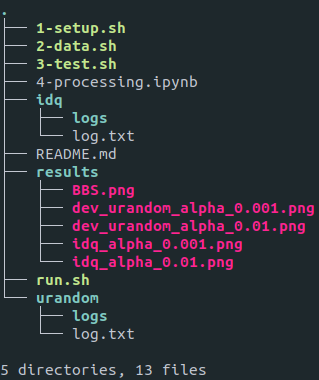

# NIST-independence (Fail)
- Dataset of result logs obtained from application of [NIST SP 800-22 Revision 1a Statistical Test Suite](https://csrc.nist.gov/publications/detail/sp/800-22/rev-1a/final) on 2 RNGs - /dev/urandom (tRNG) and [ID Quantique Quantis 4M](https://www.idquantique.com/random-number-generation/products/quantis-random-number-generator/) (qRNG).
- Correlation and Independence study of the 11 tests of randomness defined in the NIST battery. See [1].

## Dependencies
- os
- seaborn

## The Dataset
The directory structure is as follows:

The respective **logs** directories contain 100 sub-directories each, and each of these sub-directories contain 11 result logs for 11 out of 15 tests of randomness defined in NIST used in our study. See [1].

## Methodology
- NIST runs locally in its own environment (i.e. only inside the directory you extract the package to) and saves the result logs in a subfolder expriments/AlgorithmTesting. Therefore there is no way to run multiple instances in parallel (the logs will be overwritten and we'll only get a single log for the last one to finish). So, the script creates 100 copies of the entire package after building it once (with make) and performs 100 runs in parallel.
- They didn't specify which value they chose for alpha, whether 0.01 or 0.001. NIST documentation recommends 0.01. I tried both and got the exact same results.

- NIST is run with a script in the package called assess in the format ./assess <bitstream_length> i.e. ./assess 1000000 in our case. Then NIST asks for number of bitstreams: which is 300 in our case. So, it divides the input file into 300 files (bitstreams) and runs the tests on 1000000 bits in each.

- Therefore the size of one input file = 300*1,000,000 bits ~ 300Mb ~ 40MB.
- This process needs to be repeated 100 times. Therefore we need 100 40MB files.
- They chose a subset of 11 tests from 15 since the other 4 require much more data and time to run. I also ran only those 11 tests.

## Usage
- Python packages used in the jupyter notebook **4-processing.ipynb** are **os, numpy, scipy, pandas and seaborn**. Installing seaborn alone should cover all these as dependencies, except os.
- Execute **1-setup.sh**, **2-data.sh**, **3-tests.sh** and **4-processing.ipynb** in order.
    - **1-setup.sh** sets up 100 NIST instances
    - **2-data.sh** generates 100 .dat random files of random data from /dev/urandom in a new subdirectory **data**
    - **3-test.sh** runs the tests and collects logs in a new subdirectory **logs**
    - **4-processing.ipynb** evaluates the correlations between the tests and generates a CSV file **corr.csv** that contains the final results.
- At the end of the ipython notebook, a heat map plot is also generated to visualize the correlations between the tests (**darker = higher correlation**).

## Important Note
Ideally, this matrix should be perfectly symmetric. However, it is approximately symmetric. This is most likely due to the binning method being different for the first sub-interval of the k(=10) sub-intervals. As seen in **step1.4 of Algorithm CT_Single**[1], first interval is closed while the other k-1 intervals are only half-closed. However, for our purposes it is a good enough approximation as the heat-map is almost symmetric.

## Conclusions
- The paper states that they chose "some well-known good pseudorandom number generators such as **G-DES, G-BBS, G-ANSI and G-SHA-1**" in their experiments. And the correlation matrix shown in the paper is only for **G-BBS** as an example.
- The results (attached below) I obtained (with **/dev/urandom** and **ID Quantique Quantis 4M**) are completely different from what they got for **BBS** which is contradictory to their claims.

- The heatmaps obtained have all values close to zero which suggests high dependency between all tests.

## /dev/urandom with alpha = 0.01

## /dev/urandom with alpha = 0.001

## ID Quantique Quantis 4M with alpha = 0.01

## ID Quantique Quantis 4M with alpha = 0.001

## G-BBS (from original paper)

## References:
1. Fan, Limin, Hua Chen, and Si Gao. **"A general method to evaluate the correlation of randomness tests."** International Workshop on Information Security Applications. Springer, Cham, 2013.
